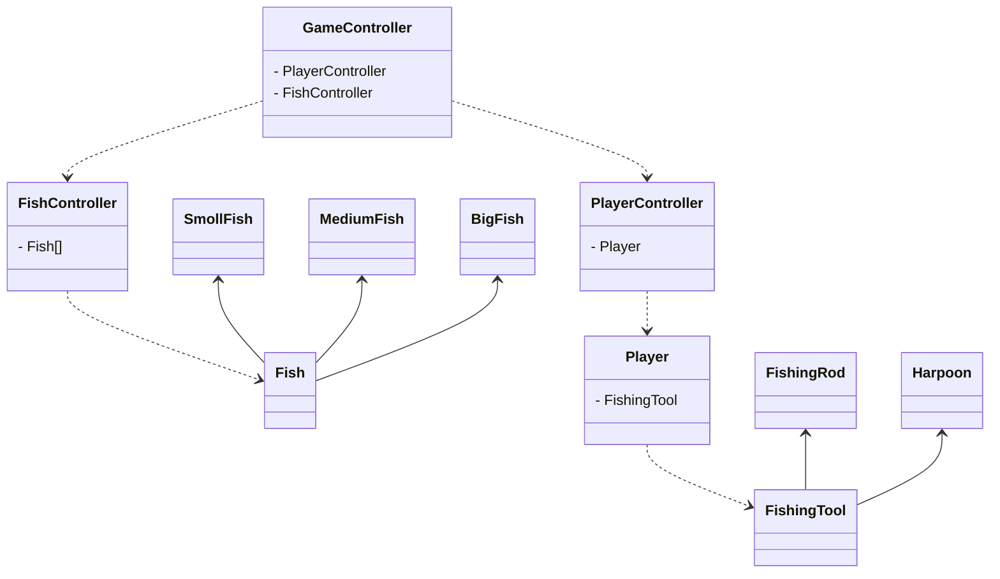

# Implementation ideas
## ClassDiagram

## Fishing rod
### Throwing
With a rod the player could charge the throw (at a certain direction?) and on release the character throws the line. The throwable object (hook, bob etc.) flows in a simple arc and once it hit the surface of the water a line and a hook is generated down from that point,
### Catching
Once fish has begun jerking or has bitten the line player can pull on the line to hook the fish. Once hooked the player can reel the fish in.
### Rod alternative: Harpoon
In the bottom of the boat is an harpoon that can be aimed and shot at the fish. If hit the fish are connected to the harpoon can can be pulled back to the boat.
## Fish
### Movement
Fish movement could be implemented by having a fish select a waypoint for itself and move towards it. After reaching the waypoint a new one is created. Rinse & repeat. To limit the area, where the fish are able to move in, the game controller could have a bounding box etc in a fish controller and the fish then ask the controller for the bounds of movement.

### Catching
When fish is close enough to a hook (with a lure) they could start going towards it. Once there they could either start to jerk the line before biting it or straight up bite it. Once the fish has bitten the hook simply connect the fish to the line.
